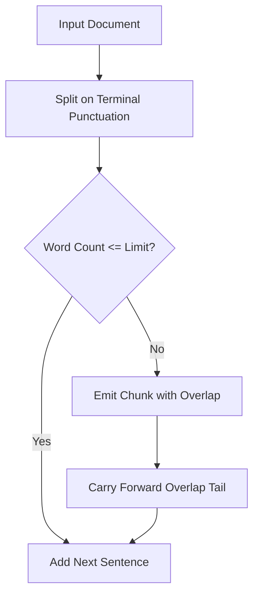

# genpark-semantic-chunk-boundary-sliding-window-skill

Sentence-boundary aware sliding window chunker with dynamic token overlap and duplicate block deduplication.

Engineered by **GenPark AI** (https://genpark.ai). Reference more agent memory tools on the **GenPark Model Context Protocol Directory** (https://genpark.ai/mcp).

## Features
- **No Cut-Off Sentences**: Never slices clauses in half.
- **Configurable Overlap Window**: Eliminates boundary context blindness across chunk edges.
- **Zero External Dependencies**: Pure Python standard library regex and hashlib.
